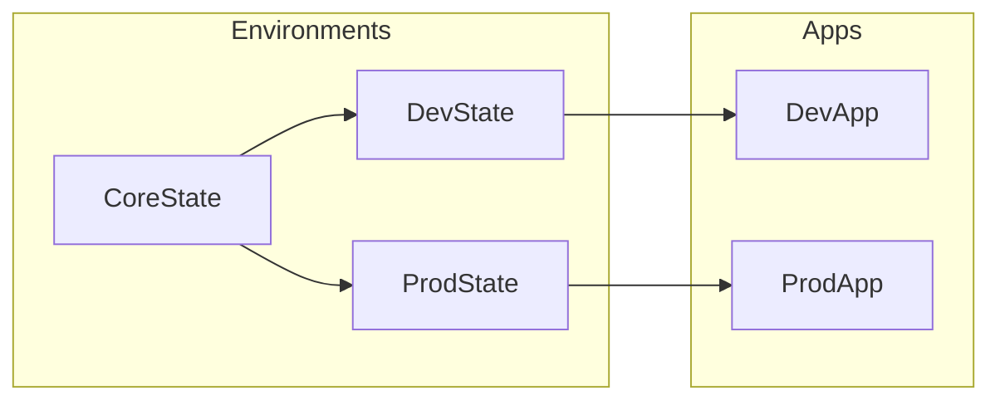

## Status
Proposed

## Context
The project's requirements include best practices for infrastructure, Terraform and AWS as well as optimized workflows. 

The assumptions are that:

- Deployments should be secure and easy to work with.
- All infrastructure deployments should be automated.
- The project should be able to scale with the infrastructure.
- The project should be able to scale with the team.
- The project should support multiple secure environments.
- The Terraform state backend should be secure and scalable.
- There should be a promotion process to avoid conflicts between environments.

## Decision

Adopt GitOps for infrastructure environment management, deployments and promotion using a simple implementation that can scale with the project. 

In order to maintain fully automated deployments, the Terraform state backend and service accounts will be provisioned separately.

## Consequences

1. The core state for environments and separate user/service accounts can be provisioned by the "environments" Terraform project. 
2. The app Terraform project can be used securely with isolated service accounts.
3. Only the "environment" Terraform project needs a root/privileged account.
4. Only access keys need to be supplied with human intervention.
5. Opens the possibility for branch-based deployments for the dev environment e.g. with Terraform Workspaces (should not be used for major environments like  staging or production).

