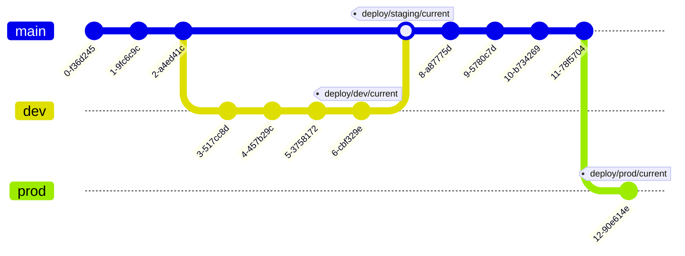

## Status
Accepted

## Context
The project's requirements include best practices for infrastructure, Terraform and AWS as well as optimized workflows. 

The assumptions are that:

- Deployments should be secure and easy to work with.
- All infrastructure deployments should be automated.
- The project should be able to scale with the infrastructure.
- The project should be able to scale with the team.
- The project should support multiple secure environments.
- The Terraform state backend should be secure and scalable.
- There should be a promotion process to avoid conflicts between environments.

## Decision

Adopt GitOps with GitHub for infrastructure environment management, deployments and promotion using a simple implementation that can scale with the project. 

GitOps essentially means that the infrastructure is managed through Git, and changes are made through pull requests. In this model, our branches represent environments, and the promotion process is a simple merge.

Furthermore, communication on deployments done through tags, which later in the future can be used for managing rollback strategies, for example, by using GitHub Actions.

In order to maintain fully automated deployments, a `Core` infrastructure project/environment will provision:

- Environments (e.g. Dev, Prod)
- State Backends (i.e. tfstate)
- User and service IAM accounts (e.g. GitHub)
- Pipelines and their Container Registry (i.e. GitHub Environments, Secrets, Variables)

Meanwhile the `App` infrastructure project will provision and be under GitHub's deployment automation:

- Application
- Database 
- Networking
- IAM

Finally, with these concepts put together, we can see how the environments are managed and promoted:

The promoetion from `dev` to `prod` will be handled by a simple merge, where there is a branch for each environment:

## Consequences

1. The `core` state for `environments` and separate user/service accounts can be provisioned by the "environments" Terraform project. 

2. The app Terraform project can be used securely with isolated service accounts.

3. Only the "environment" Terraform project needs a root/privileged account.

4. No human intervention needed to supply AWS access keys.

5. Opens the possibility for branch-based deployments for the dev environment e.g. with Terraform Workspaces (should not be used for major environments like  staging or production).

5. Doing [least-privileged](https://docs.aws.amazon.com/IAM/latest/UserGuide/best-practices.html#grant-least-privilege) IAM roles for the pipelines and services is a simple workflow.

6. The promotion process is simple and can be automated with GitHub Actions.