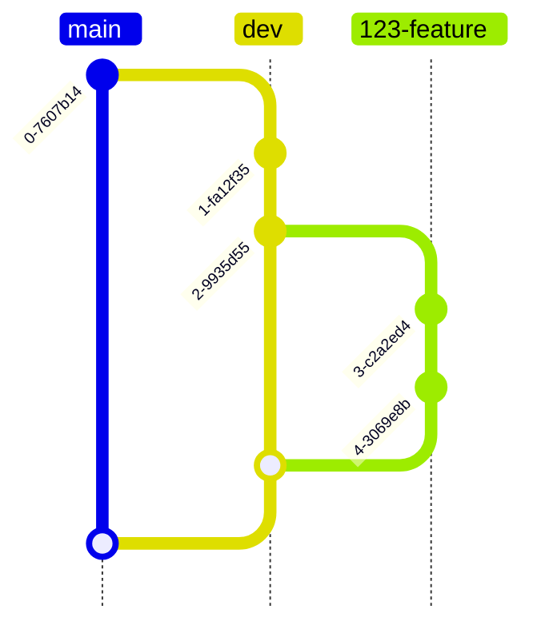

## Status
Proposed

## Context
Following GitOps best practices, and considering that we already have a `dev` branch, we need to decide how to handle the deployment and promotion path of new features and bug fixes without handling the image configuration manually.

## Decision
Every separate piece of work will be defined in Github Issues, and each issue will have its own branch. 

Freeing `dev` to represent the development environment will help automate the commit with the image URL programmatically.

`main` and `dev` will become protected environments, and only automated pull requests will enable promotions, for example:

- `dev` to `main`
- `123-feature` to `dev`

## Consequences

1. Enabling automated pull requests will require a CI/CD pipeline job.
2. The `dev` branch will become a deployment environment, so direct edits will be disallowed
3. `dev` will promote to `main`.
4. `main` will be the production environment.
5. Developers will work off `dev`, therefore, `dev` will become the default branch.

