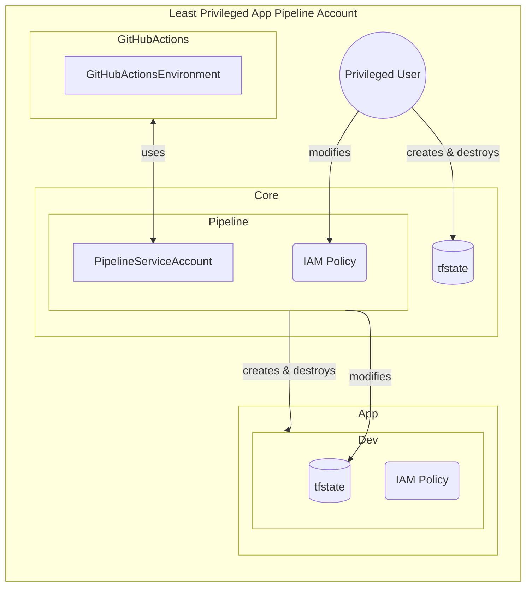

## Status
Accepted

## Context
To keep the pipeline secure, it’s important to ensure it has the least amount of privileges—just enough to get the job done, or in other words, following the [principle of least-privilege](https://www.paloaltonetworks.com/cyberpedia/what-is-the-principle-of-least-privilege), but without hindering developers.

Security is closely tied to both usability and Developer Experience (DevEx). If something is hard to use, developers or users might take shortcuts or make mistakes that could lead to vulnerabilities. 

That’s why designing for good usability helps everyone follow security best practices more easily, reducing risks along the way. In this sense, making security user-friendly for developers is essential.

DevEx [according to DX](https://getdx.com/blog/developer-experience/#:~:text=Developer%20experience%2C%20or%20DevEx%2C%20refers,roles%20in%20enhancing%20developers'%20performance.)

> Developer experience, or DevEx, refers to how developers feel about, think about, and value their work. DevEx extends beyond just the tools used; factors such as clear project goals, having enough time for deep work, and codebase experience play significant roles in enhancing developers’ performance. These elements contribute to developer productivity, satisfaction, engagement, and employee retention, underscoring the importance of a positive DevEx.
>
> Interruptions, unrealistic deadlines, and lack of reliability in development tools are examples of issues that can create a bad developer experience.

Cost of bad DevEx [according to Atlassian](https://www.atlassian.com/blog/developer/developer-experience-report-2024)

> 
 Sixty-nine percent of developers are losing eight hours or more per week to inefficiencies. That’s 20% of their time. While this is shocking, perhaps more alarming is that less than half of them believe their leaders are aware of this issue. Similarly, less than half think their organization prioritizes developer experience.

## Decision
Following up on the design from the [GitOps ADR](2%20-%20GitOps.md), the pipeline should have the least privileges possible, only what is needed to create the infrastructure and deploy the application.

## Consequences

1. Simple and repeatable workflow to secure the pipeline:
    1. Develop with a privileged user, initially.
    1. Deploy with pipeline or new user account.
    2. If one gets a deployment error, add IAM to the pipeline account in the `pipeline` module.
    3. `terraform apply` the `core` project's pipeline IAM.

2. The person responsible for administering deployment environments doesn't need to configure environments, secrets or variables in GitHub, which tends to be error-prone and time-consuming.

3. The configuration of GitHub is fully automated and can be versioned in the repository.

4. Clear separation of concerns: 

    1. **Privileged user**: is responsible for creating and destroying the `core infrastructure`.
    2. **Pipeline account**: responsible for deploying the app.
    3. **Pipeline IAM**: responsible for managing the IAM policies of the pipeline account.
    4. **App IAM**: responsible for managing the IAM policies of the application.

