## Status

In progress

## Context

The project requires a way to manage machine configuration files that are used in the Terraform configuration. These files are used to configure the machine that the application runs on.

Modifying .tfvars can happen during development and unacknowledgely cause errors. 

This is a follow up of [ADR 2](2%20-%20GitOps.md), [ADR 6](6%20-%20Least%20Privileged%20App%20Pipeline%20Account.md) and [ADR 7](7%20-%20Least%20Privileged%20pipeline%20with%20good%20DevEx.md).

## Decision

If we look at the [Terraform input variable precedence](https://developer.hashicorp.com/terraform/language/values/variables#variable-definition-precedence) we can know a few things:

- `terraform.tfvars` and `terraform.tfvars.json` (and any `*.auto.tfvars`) files are automatically loaded, in that order of precedence, the later having higher priority.

- `-var` flags on the command line are applied last and have the highest priority.

Therefore, the decision is to:

- Use the `terraform.tfvars` file for default values for all environments.

```mermaid

graph LR
    subgraph terraform_app["terraform/app"]
        direction LR
        
        terraform_tfvars["terraform.tfvars"]
        terraform_environment_tfvars_json["terraform-[environment].tfvars.json"]

        terraform_tfvars_json["terraform.tfvars.json"]
        
    end

    terraform_app 
    tfstate[("terraform.tfstate")]

    subgraph terraform
        direction TB
        var_environment["-var='container_image=...'"]
        var_container_image["-var='environment=...'"]
    end

    var_environment-- overrides --> tfstate
    var_container_image-- overrides --> tfstate

    tfstate-- overwrites --> terraform_environment_tfvars_json

    style terraform_tfvars stroke:#f00, stroke-width:2px, fill:#300
    style terraform_environment_tfvars_json stroke:#0f0, stroke-width:2px, fill:#030
    style terraform_tfvars_json stroke:#f60, stroke-width:2px, fill:#630, stroke-dasharray:5,5

```

## Consequences

1. The `terraform.tfvars` file will be the default file for all environments.
2. The `terraform.tfvars.json` file will be used for developers to modify locally, after copying it from the `terraform-<environment>.tfvars.json` file.
3. The pipeline will only set values through `-var` flags, avoiding confusion.
4. The terraform state will always hold a copy of the last environment-specific configuration, which means that if the one from the person applying the plan differs, it will be overwritten:
    
    1. Helping to detect what was the last image used.
    2. Helping to detect if terraform was applied to the wrong environment.
    3. Making it easy for developers to update their local configuration.

5. The script `switch-environment` was created for safe environment switching, which knows to modify the `terraform.tfvars.json` file with the correct environment value.

