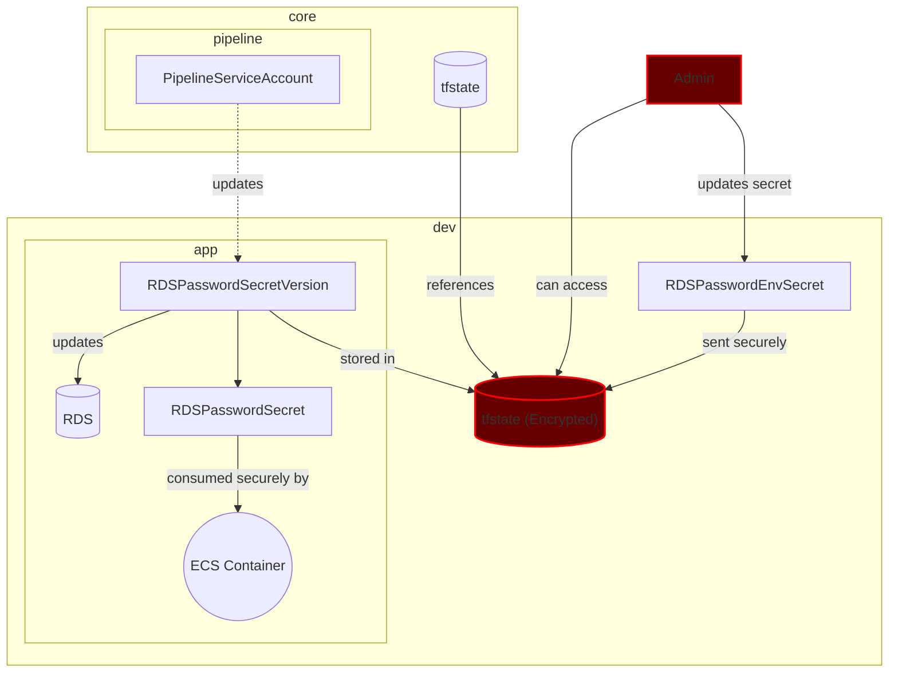

## Status
Accepted

## Context
The database needs to be created securely and then have the service consume the password without exposing it.

## Decision

The design boils down to:

- The password for the RDS database will be stored in **Secrets Manager**. 
- The secret will be linked to the **ECS** container via **it's Secret Manager integration**. 
- The password will *have* to be stored in the terraform state file as a secret version. 
- The secret version will be updated by the admin through Github Actions (**this is required for Terraform to change the RDS master password**).

In this design the main attack vector is the password being exposed as plain text in the state file even if the application is consuming it securely. The attack vector being the admin having access to the state file and being able to decrypt secrets if they have the access.

The `production` environment will need to have an encrypted terraform state to prevent the password from being exposed.

Encrypt the terraform state for the production environment, therefore, the `core` environment must support an option to encrypt a specific environment's state bucket.

## Consequences

1. The `production` environment will always have an encrypted state.
2. The `dev` environment can have an unencrypted state to troubleshoot pipeline issues and initial development.
3. The `staging` environment can have an unencrypted state, as long as it does not use production data.
4. The `core` terraform state doesn't need to be encrypted since it is not part of the attack vector.
5. The password for each environment can be updated through Github Actions environment secrets.
6. There are two assets with some risk (highlighted in the diagram), the bucket itself if it can be accessed and the administration user account, which is required to create the project `core`
