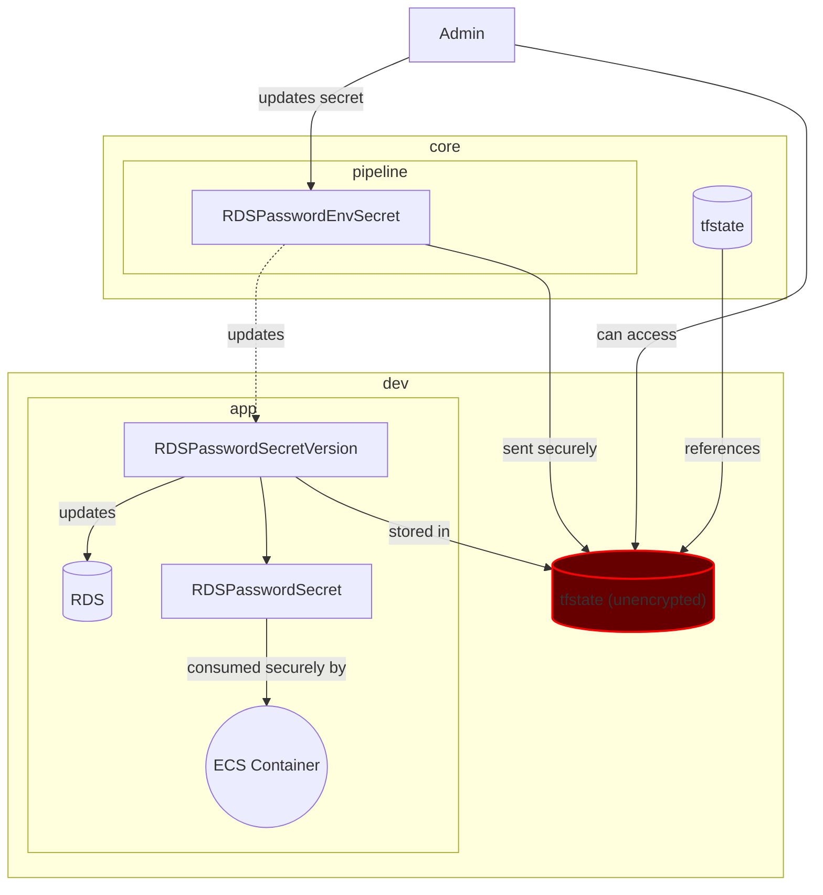

## Status
In progress

## Context
The database needs to be created securely and then have the service consume the password without exposing it.

In this design the main attack vector is the password being exposed as plain text in the state file even if the application is consuming it securely. The attack vector being the admin having access to the state file.

The `production` environment will need to have an encrypted terraform state to prevent the password from being exposed.

## Decision

Encrypt the terraform state for the production environment, therefore, the `core` environment must support an option to encrypt a specific environment's state bucket.

## Consequences

1. The `production` environment will always have an encrypted state.
2. The `dev` environment can have an unencrypted state to troubleshoot pipeline issues and initial development.
3. The `staging` environment can have an unencrypted state, as long as it does not use production data.
4. The `core` terraform state doesn't need to be encrypted since it is not part of the attack vector.
5. The password for each environment can be updated through Github Actions environment secrets.
